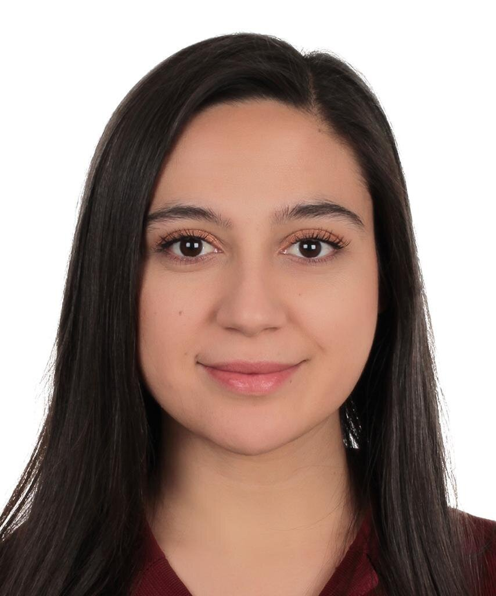

My name is Seyma. I am interested in data analytics and data visualization.

{fig-align="center" width="4.2 cm" height="5.9cm"}

# Education

-   B.S., Industrial Engineering, Gazi University, Turkey, 2013-2018.
-   M.S., Industrial Engineering, Hacettepe University, Turkey, 2025 - ongoing.

## Employements

1.  Aselsan, Senior Specialist Engineer, 2025-ongoing.

2.  Meteksan Defence, Senior Project Quality Management Engineer, 2022-2025

3.  Turkish Aerospace, Quality Systems Engineer 2018-2022

## Internships

1.  Intern at Material Recovery System, Lecce/Italy July 2015-September 2015

2.  Intern at Turkish Aerospace, Ankara/Turkey June 2016-July 2016

3.  Intern at ASELSAN, Ankara/Turkey June 2017-July 2017

4.  Candidate Engineer at Turkish Aerospace, Ankara/Turkey March 2018-July 2018

[CV Download Link](SeymaSezerYesilyurtCV.pdf)
